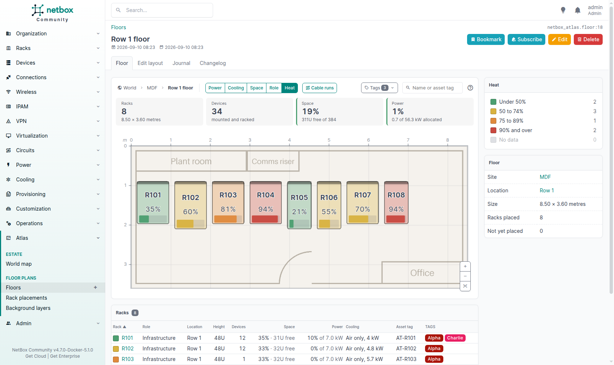

# Extending

Two ways to build on the plugin: add a colouring from another plugin, or read a floor through the REST API.

## Add a colouring

Each level has a registry of colourings. The buttons above each drawing list what is registered.

| Level | Register with | The function gets |
|---|---|---|
| Floor plan | `netbox_atlas.overlays.register_overlay` | The racks on the floor, as `Rack` objects with role, location, tenant and tags loaded |
| Rack view | `netbox_atlas.device_overlays.register_device_overlay` | The mounted devices. Each has `.device` (with role, device type, tenant and tags loaded), `.port_count`, `.connected_count` and `.power` (`allocated_watts` and `maximum_watts`, or `None`). |
| World map | `netbox_atlas.site_overlays.register_site_overlay` | The sites on the map, as `Site` objects with region, group and tenant loaded |

All three take the same arguments: `register_…(name, label, fn, description='', legend=None)`.

- `name` goes in the URL (`?overlay=…` on the floor and the map, `?colour=…` on the rack), so keep it stable.
- `label` is the button text, and `description` its tooltip.
- `fn` gets the whole set at once, not one item at a time. Read what you need in one query for the set, not one query per item.

### What the function returns

A dictionary from each item's primary key to a `netbox_atlas.overlays.RackValue(colour, label, value)`:

- `colour`: a hex colour such as `'#4c9f70'`.
- `label`: the reading, shown in the hover card, and in the legend when the legend is built from the data.
- `value`: `None` means "no data": the item is drawn grey and counted under **No data**. A number from 0 to 100 draws a gauge on a floor rack and prints the percentage. Text draws no gauge.

An item missing from the dictionary counts as no data. If the function raises, the error is logged and every item is drawn grey; the page still opens.

### The legend

- **Fixed bands:** pass `legend=[LegendEntry(colour, label), …]` (`netbox_atlas.overlays.LegendEntry`). Every colour your function returns must be one of these colours. The legend counts and filters by colour. For "how full" colourings, `netbox_atlas.palette.utilisation_colour(percent)` and `netbox_atlas.overlays.UTILISATION_LEGEND` give the plugin's own four bands.
- **Bands from the data:** pass no legend. The legend then has one entry per distinct `label`, and filters by label, so two labels may share a colour.

The **No data** entry is always added last.

### Example: heat load against cooling capacity

This colours each rack by a heat load recorded in a rack custom field, `heat_load_kw`, against the rack's own cooling capacity. A rack with either value missing is no data.

```python
# yourplugin/atlas.py
from netbox_atlas.overlays import RackValue
from netbox_atlas.palette import utilisation_colour


def heat_overlay(racks):
    values = {}
    for rack in racks:
        load = rack.custom_field_data.get('heat_load_kw')
        if load is None or not rack.cooling_capacity:
            continue  # no data: grey, and counted under "No data"
        percent = float(load) / float(rack.cooling_capacity) * 100
        values[rack.pk] = RackValue(
            colour=utilisation_colour(percent),
            label=f'{load:g} of {rack.cooling_capacity:g} kW',
            value=percent,  # a number, so the floor draws a gauge
        )
    return values
```

Register it from your plugin's `ready()`:

```python
# yourplugin/__init__.py
from netbox.plugins import PluginConfig


class YourPluginConfig(PluginConfig):
    name = 'yourplugin'
    # ...

    def ready(self):
        super().ready()
        from netbox_atlas.overlays import UTILISATION_LEGEND, register_overlay

        from .atlas import heat_overlay

        register_overlay(
            'heat',
            'Heat',
            heat_overlay,
            description='Heat load against cooling capacity.',
            legend=UTILISATION_LEGEND,
        )


config = YourPluginConfig
```

The result: a **Heat** button beside the built-in colourings, each rack gauged against its own cooling capacity, and the plugin's four bands in the legend.



List your plugin after `netbox_atlas` in `PLUGINS`. A name registered twice keeps the later registration, so this order also lets you replace a built-in colouring by registering its name.

## Read a floor through the REST API

`GET /api/plugins/atlas/floors/<id>/layout/` returns everything one drawing of the floor needs, for a second renderer such as a 3D view. It applies the same permissions as the floor page: racks and devices the caller may not view are left out.

| Query parameter | Effect |
|---|---|
| `overlay=<name>` | The colouring to evaluate. Default: the `default_overlay` setting. |
| `runs=1` | Also return the cable runs between racks and the cables that leave the floor. |

Positions and sizes are in centimetres from the room's top-left corner. A rack's `x` and `y` are its centre.

| Key | Holds |
|---|---|
| `floor` | `id`, `name`, `width_cm`, `depth_cm` |
| `overlay` | `name`, `label`, and `legend` as a list of `colour` and `label`; `null` when no colouring is registered |
| `racks` | For each rack: `rack_id`, `name`, `x`, `y`, `rotation` (degrees clockwise), `width`, `depth`, `u_height`, `estimated_footprint`, `colour`, `label`, `fraction` (0 to 1, or `null` when the colouring measures no quantity) and `facts` (label and value pairs) |
| `layers` | The enabled background images: `id`, `name`, `source` (the image URL), `x`, `y`, `width`, `height`, `rotation`, `opacity` |
| `runs` | With `runs=1`: `rack_a`, `rack_b` and the `count` of cables between them |
| `exits` | With `runs=1`: `rack`, the `label` and `kind` of what the cables reach, their `count`, and the `x` and `y` of the point on the wall |

The three models also have the usual NetBox endpoints: `floors`, `rack-placements` and `floor-layers` under `/api/plugins/atlas/`.
